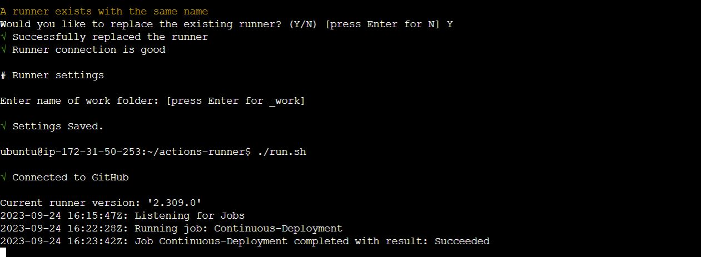
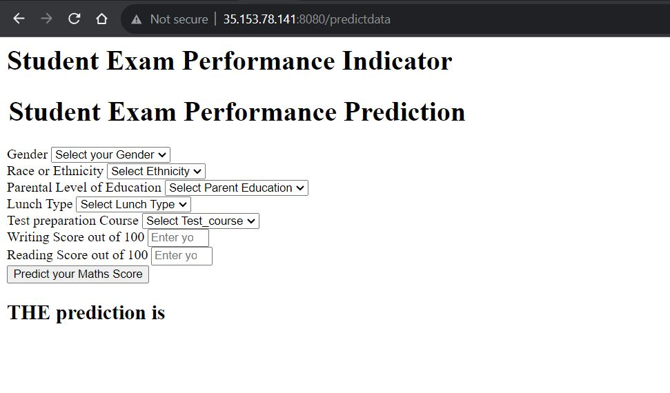
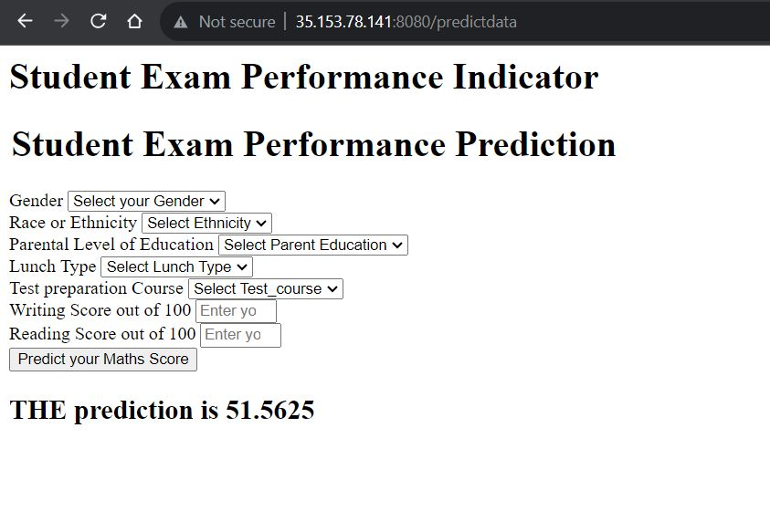

## This is ML project

In this project, deployed end to end ml application using CI CD pipelines and GitHub actions uing ECR and EC2 instance.

Developed these components:
* Data Ingestion
* Data Transformation
* Model Trainer
* Model Evaluation
* Model Deployment

### End to End Machine Learning Project deployment in AWS:
1. Docker Build checked
2. Github Workflow
3. Iam User In AWS

### Configured EC2 as self-hosted runner, and did setup GitHub secrets:
* AWS_ACCESS_KEY_ID=
* AWS_SECRET_ACCESS_KEY=
* AWS_REGION = 
* AWS_ECR_LOGIN_URI = 
* ECR_REPOSITORY_NAME =

### EC2 instance connection establshied with GitHub, and successfully completed Continuous Integration, Continuous Delivery and Continuous-Deployment

  

### Run instance with Public IPv4 address

  

  

